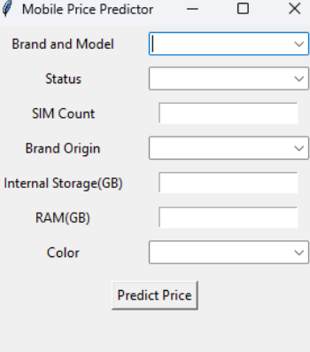
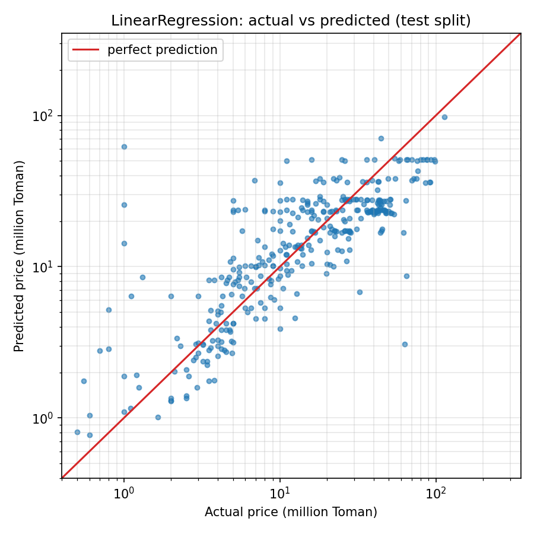

# Predicting Mobile Prices

Linear regression on 1,751 used-phone listings scraped from divar.ir, with a small desktop app that predicts a listing price from brand, condition, storage, RAM and colour.

<p align="center">
  
  &nbsp;&nbsp;
  
</p>

[](LICENSE)

## Overview

This was the final project for the Linear Algebra course at Shiraz University, Spring 2024, done together with [AmirHossein Roodaki](https://github.com/Roodaki). The data was scraped from the Tehran mobile-phone section of [divar.ir](https://divar.ir), an Iranian classifieds site, so the dataset and the app's dropdowns contain Persian text. After the course I revisited the modelling, fixed the problems listed under Results, and restructured the repository; the original 40-page write-up is in [docs/report.pdf](docs/report.pdf).

## Pipeline

1. **Scrape** (`src/scraper/`): Selenium walks the listing page, opens each ad and saves its detail rows to `data/raw/item_details.csv` (3,221 rows).
2. **Clean** (`src/features.py`, walked through in `notebooks/01_cleaning.ipynb`): parse Persian numbers, units and prices, normalise colour text, drop duplicates and placeholder prices. 3,221 rows become 1,751.
3. **Features** (`src/features.py`): one-hot encode brand, condition, origin and colour; standardise SIM count, storage and RAM. Fitted on the training split only.
4. **Model** (`src/train.py`, `notebooks/02_modelling.ipynb`): linear regression on log(price), compared with ridge; evaluated on a held-out 20% split.
5. **App** (`app/app.py`): Tkinter form that loads the saved model from `models/price_model.joblib`.

## Cleaning rules

In order: drop rows with a missing field (3,221 to 2,165), drop rows where a field says "not specified" (2,150), drop rows with no colour left after removing Latin words (2,001), drop exact duplicates (1,806), and keep only prices between 500,000 and 300,000,000 Toman (1,751). On Divar a price of 1,000 Toman means "contact me", and one iPhone 4 was listed at 48 billion Toman.

Brand is the first token of the "Brand and Model" field (18 brands). The full model name is not used: 315 model names on about 1,400 training rows would mostly be memorised.

## Results

Test-split metrics, prices in Toman. The two approaches use different cleaning and different splits, so the rows are not on identical data; the original numbers are what the notebook reproduces from the original pipeline.

| Approach | Test rows | R² | MAE | RMSE |
|---|---|---|---|---|
| Original: label-encoded categories, IQR filter, raw price | 197 | 0.51 | 10.9M | 13.7M (MSE 1.87e14) |
| Median-price baseline | 351 | -0.21 | 15.8M | 23.7M |
| Revised: one-hot brand/condition/origin/colour, log(price), LinearRegression | 351 | 0.50 | 9.8M | 15.2M |
| Revised, Ridge (alpha 1.8 by 5-fold CV) | 351 | 0.50 | 9.8M | 15.2M |

The original submission reported only the MSE and concluded that linear regression was unsuitable. The real problems were elsewhere. Brand-and-model, colour, condition and origin were label-encoded to integers, so the model fitted a slope over an alphabetical ordering of 315 model names. The encoders and the IQR outlier filter were fitted on the whole table before the split, 50 of the 197 test rows were exact copies of training rows because the scraper revisited listings, and 17 test predictions were negative prices. The revised pipeline splits first, one-hot encodes, predicts log(price) so predictions are positive and errors are relative, and reports a baseline. Its R² is about the same as before, but it is now a number you can believe, and the app no longer retrains the model on every launch. Ridge adds nothing over plain least squares with this few features, so the plain model is kept.

## Usage

```bash
pip install -r requirements.txt
python src/features.py      # rebuild data/cleaned_item_details.csv from the raw scrape
python src/train.py         # train, print metrics, write docs/results.png and models/price_model.joblib
python app/app.py           # run the predictor (uses the saved model)
python src/scraper/main.py  # re-scrape divar.ir; see note below
```

The scraper needs Chrome. Selenium 4.6+ downloads a matching driver by itself. Divar changes its page markup often; the listing-page selectors from 2024 no longer matched when this was last checked (September 2026) and were replaced, but expect to update `src/scraper/constants.py` again before running it.

## Project structure

```
app/app.py                    Tkinter predictor, loads the saved model
data/raw/item_details.csv     scraped listings, Persian text
data/cleaned_item_details.csv output of src/features.py
docs/                         report.pdf, assignment.pdf, app.png, results.png
models/price_model.joblib     trained pipeline plus dropdown categories
notebooks/01_cleaning.ipynb   why each cleaning step exists
notebooks/02_modelling.ipynb  original vs revised model, coefficients
src/features.py               cleaning and encoding shared by notebooks, trainer and app
src/train.py                  train, evaluate, save
src/scraper/                  Selenium scraper
```

## Limitations

- Small, noisy dataset: 1,751 listings from one scrape in July 2024, one city, self-reported specs.
- Listing prices, not sale prices. Sellers ask; nobody recorded what was paid.
- Brand without model name cannot separate an iPhone 7 from an iPhone 13 Pro Max. That is where most of the remaining error sits.
- Linear models only, by design: this was a linear algebra course project.

## License and credits

MIT, see [LICENSE](LICENSE). Built with [AmirHossein Roodaki](https://github.com/Roodaki). The original course report is [docs/report.pdf](docs/report.pdf) and the assignment sheet is [docs/assignment.pdf](docs/assignment.pdf).
